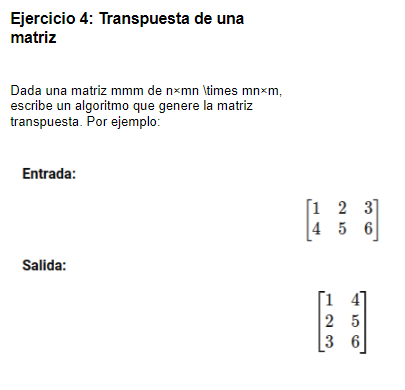

# 1. Formulación del problema

<p align="center">
  
</p>

# 2. Resolución

> I) Entrada del n° de filas y columnas en la matriz

```bash
import java.util.Scanner;
```

```bash
    public static void main(String[] args) {
        Scanner sc = new Scanner(System.in);
        System.out.println("Ingresar dimension [n]: ");
        int n = sc.nextInt();
        
        if(n <= 0){
           n = sc.nextInt();;
        }  
        System.out.println("Ingresar dimension [m]: ");
        int m = sc.nextInt();
        
        if(m <= 0){
           m = sc.nextInt();;
        } 
```

> II) Ingreso de numeros enteros en la matriz 
```bash
transpuesta(n,m);
```

```bash
public class Main {
    public static void transpuesta(int n,int m){
    Scanner sc = new Scanner(System.in);
    int[][] Matriz = new int[n][m]; 
    int[][] Transpuesta = new int[m][n];
    
    for(int i=0; i < n; i++){
        
        for(int j=0; j < m;j++){
            System.out.print("["+i+"]"+"[" + j+"]");
            Matriz[i][j] = sc.nextInt();           
        }
    }
```
> III) Impresión de matrices (original y transpuesta) e transferencia de elementos de la matriz original hacia la transpuesta

```bash
    System.out.println("MATRIZ ORIGINAL:");
     for(int i=0; i < n; i++){
        for(int j=0; j < m;j++){
         System.out.print("["+Matriz[i][j]+"]"); 
        }
    System.out.println("");
    }
    System.out.println("MATRIZ TRANSPUESTA:");
    for(int i=0; i < m; i++){
        for(int j=0; j < n;j++){
        Transpuesta[i][j] = Matriz[j][i];
        System.out.print("["+Transpuesta[i][j]+"]"); 
        }
    System.out.println("");    
    }
    }
```

### Codigo completo

```bash
import java.util.Scanner;

public class Main {
    public static void transpuesta(int n,int m){
    Scanner sc = new Scanner(System.in);
    int[][] Matriz = new int[n][m]; 
    int[][] Transpuesta = new int[m][n];
    
    for(int i=0; i < n; i++){
        
        for(int j=0; j < m;j++){
            System.out.print("["+i+"]"+"[" + j+"]");
            Matriz[i][j] = sc.nextInt();           
        }
    }
    
    System.out.println("MATRIZ ORIGINAL:");
     for(int i=0; i < n; i++){
        for(int j=0; j < m;j++){
         System.out.print("["+Matriz[i][j]+"]"); 
        }
    System.out.println("");
    }
    System.out.println("MATRIZ TRANSPUESTA:");
    for(int i=0; i < m; i++){
        for(int j=0; j < n;j++){
        Transpuesta[i][j] = Matriz[j][i];
        System.out.print("["+Transpuesta[i][j]+"]"); 
        }
    System.out.println("");    
    }
    }

    public static void main(String[] args) {
        Scanner sc = new Scanner(System.in);
        System.out.println("Ingresar dimension [n]: ");
        int n = sc.nextInt();
        
        if(n <= 0){
           n = sc.nextInt();;
        }  
        System.out.println("Ingresar dimension [m]: ");
        int m = sc.nextInt();
        
        if(m <= 0){
           m = sc.nextInt();;
        } 
        transpuesta(n,m);
    }
}
```
